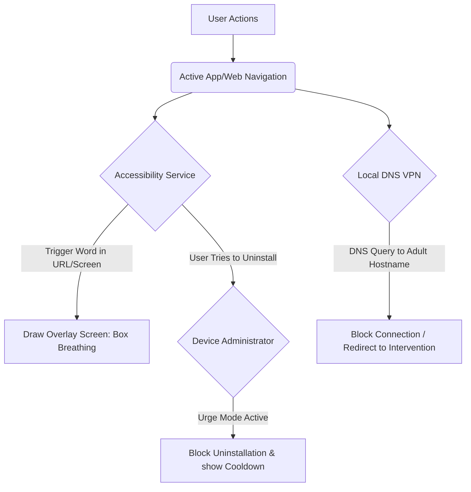
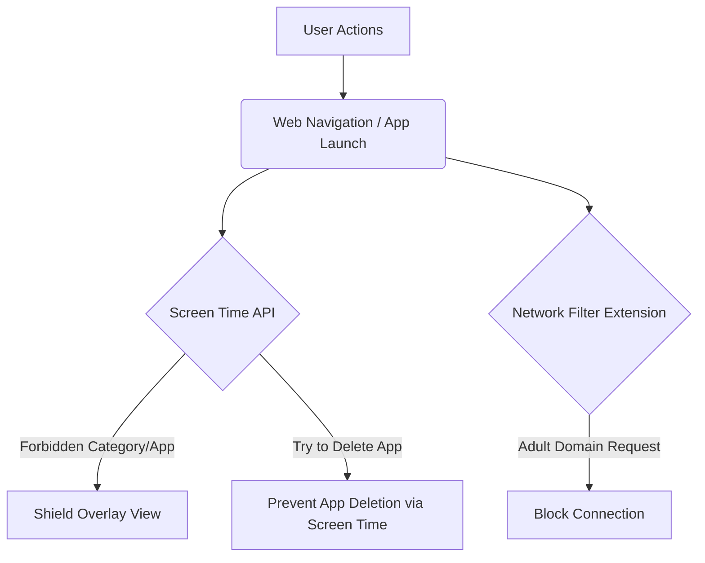

# Zenith Mobile — Technical Architecture & Implementation Blueprint

Zenith Mobile is the logical evolution of the Zenith Anti-PMO suite. Replicating Zenith's system-level protection and premium minimalist aesthetic on highly sandboxed mobile operating systems (iOS and Android) requires a sophisticated, platform-specific hybrid model.

Below is the architectural blueprint for implementing Zenith Mobile with system-wide protection, zero external database requirements (fully local), and urge-fueled uninstallation prevention.

---

## 📱 1. Tech Stack Recommendation: Flutter or React Native?

We highly recommend **Flutter (Dart)** or **React Native (TypeScript)** with native platform integrations:

* **Why:** You can share 90% of the UI code (Overview dashboard, Past Streaks, Journal Entries, and the Box-Breathing Intervention screen).
* **Native Bridges (Platform Channels):** You will write custom native wrappers (Swift for iOS, Kotlin/Java for Android) to interact with high-level system APIs like Android Accessibility/VPN and iOS Screen Time.
* **Local Database:** Use **Hive** or **ObjectBox** (for Dart/Flutter) or **WatermelonDB** (for React Native). These are ultra-fast, local-first NoSQL databases that replicate the behavior of `chrome.storage.local` with zero latency, offline capabilities, and zero monthly server costs.

---

## 🤖 2. Android Architecture (Air-Tight Protection)

Android offers powerful APIs that allow Zenith to replicate the background watchdogs and web blockers of the desktop suite.

### A. System-Wide Web & App Blocking (Accessibility Service API)
* **How it works:** Zenith registers an background `AccessibilityService`. 
* **Capabilities:** 
  * It can read the active URL bar of popular browsers (Chrome, Edge, Opera GX, Brave, Firefox, Samsung Internet) in real-time.
  * It can inspect on-screen layout text (passive DOM content scanning) for mature keyword trigger matching.
* **Intervention:** If a trigger matches, the service instantly launches an **Overlay Window** (a custom Android view rendering our box-breathing intervention page) directly over the offending app, preventing user interaction.

### B. System-Wide Network Shield (VpnService API)
* **How it works:** Spawns a **Local DNS Proxy VPN** running completely on-device (no traffic leaves the phone).
* **Capabilities:** It intercepts all DNS lookup requests. If an app or browser requests an adult domain (e.g. `xnxx.com` or `civitai.com`), Zenith intercepts the IP resolution, blocks the connection, and sends the user to the local redirection page. This blocks adult content inside *every* browser and inside *every* third-party app (like Reddit, Instagram, etc.).

### C. Anti-Uninstall Watchdog (Device Administrator API)
* **How it works:** Requests **Device Administrator** or **Device Owner (MDM)** privileges.
* **Protection:** If the user gets an urge and tries to uninstall Zenith, the OS will prompt them to deactivate the Device Admin first. Zenith intercepts the deactivation request and imposes a **mindful cooldown timer** (e.g. a 5-minute wait with breathing exercises) before they are allowed to turn it off, effectively surfing the urge.

---

## 🍎 3. iOS Architecture (Premium Sandbox Integration)

Apple has highly strict sandboxing rules, but introduces standard, highly secure frameworks for parental controls and network filtering that we can leverage.

### A. System-Wide App & Category Blocking (Screen Time / FamilyControls API)
* **How it works:** Leverages Apple's native **FamilyControls**, **ManagedSettings**, and **DeviceActivity** frameworks.
* **Capabilities:**
  * Allows Zenith to request authorization to monitor the device.
  * Zenith can block or limit specific apps (e.g. social media, mature apps) or whole App Store categories.
  * Customizes a **Shield Configuration Extension** to display a solid matte dark Zenith Box-Breathing screen instead of the default Apple Screen Time template when a blocked app is opened.

### B. Network Filtering (NetworkExtension Framework)
* **How it works:** Uses the `NEFilterDataProvider` and `NEFilterControlProvider` extensions.
* **Capabilities:** Intercepts all outgoing Safari and browser web requests on the device at the network socket layer. If a blocked domain matches, the connection is instantly closed or redirected.

### C. Anti-Uninstall / App Deletion Prevention
* **How it works:** Through the **FamilyControls** framework, once Zenith is authorized, the app can programmatically block its own deletion. The user cannot delete the app icon or remove the profile from Settings without the Zenith passcode or satisfying the urge cooldown.

---

## 🎨 4. Design Guidelines (Zenith Premium Matte Dark)

The mobile UI must match the exact premium minimalist aesthetic we built for the desktop dashboard:

* **Dark Matte Palette:** Solid `#0a0a0c` background, `#101014` cards, thin borders, and crisp `#ffffff` text.
* **Zero Gradients:** Solid flat colors only. 
* **Zero Emojis:** Use clean, minimalist monochrome icons (e.g., Lucide Icons, SF Symbols on iOS, or Material Icons on Android styled in pure monochrome).
* **Core Screens:**
  1. **Overview:** Large circular or flat streak day count, urge counter, and a "Surf Urge" quick-launcher.
  2. **Journal:** Simple minimalist text inputs to log thoughts and feelings, with a clean delete button.
  3. **Shield:** Configuration for the local VPN/DNS filter and app blocker.
  4. **Intervention:** The box-breathing animated circle that guides the user through four-second intervals (Inhale, Hold, Exhale, Hold) to neutralize urges.
